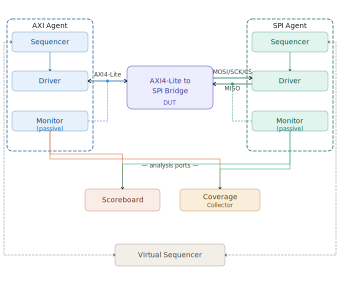

# AXI4-Lite to SPI Bridge 验证方案

## 一、验证目标

验证 AXI_slave_top 模块是否正确实现以下功能：
- AXI4-Lite 五通道握手正确，符合协议时序
- 10 个 CSR 寄存器读写正确（地址解码、WSTRB 字节选通、只读保护）
- SPI 四种模式（CPOL/CPHA）波形正确
- SPI 多种字长（4/8/16/32bit）传输正确
- 回环数据正确：AXI 写入的 MOSI 数据从 SPI 正确发出，SPI 收到的 MISO 数据正确存入只读寄存器

## 二、验证环境架构

## 三、组件说明

### 3.1 AXI Agent

负责驱动和监控 AXI4-Lite 总线。

**接口信号（S00_AXI 侧）**：时钟/复位 + AW 通道（awaddr, awvalid, awready）+ W 通道（wdata, wstrb, wvalid, wready）+ B 通道（bresp, bvalid, bready）+ AR 通道（araddr, arvalid, arready）+ R 通道（rdata, rresp, rvalid, rready）。共 6 位地址、32 位数据。

**Driver**：从 sequencer 接收 AXI 事务，按 AXI4-Lite 握手时序驱动总线。支持三种时序组合（地址先到、数据先到、同时到）。写事务含 WSTRB 配置，读事务只需地址。

**Monitor**：被动监听总线，收集完整的 AXI 传输（含地址、数据、WSTRB、响应），打包成 transaction 后通过 analysis port 送到 scoreboard 和 coverage。

### 3.2 SPI Agent

负责监控 DUT 的 SPI 侧引脚，并作为 SPI Slave 回送数据。

**接口信号**：CS, SCK, MOSI（DUT 输出）, MISO（DUT 输入）。

**Driver**：作为 SPI Slave，在检测到 CS 拉低后，在 SCK 的对应沿上采样 MOSI 数据，同时在 SCK 的另一沿上按配置的模式驱动 MISO 数据回给 DUT。MISO 回环数据由 sequence 预先写入。

**Monitor**：被动监听 CS/SCK/MOSI/MISO，检测 SPI 传输起止，从波形中提取数据帧，转换成 transaction 通过 analysis port 送出。

### 3.3 Scoreboard

接收 AXI monitor 和 SPI monitor 两路数据流，执行三项比对：
- AXI 写入 slv_reg8 的 MOSI 数据，是否等于 SPI 侧观察到的发送数据
- SPI 侧驱动的 MISO 数据，是否等于 AXI 侧从 slv_reg9 读回的数据
- AXI 写控制寄存器（mode/speed/word_len/IFG/CS_SCK/SCK_CS）后，SPI 侧波形参数是否匹配

### 3.4 RAL（Register Abstraction Layer）

以 UVM 的 uvm_reg 建模 10 个 CSR，映射到 0x00~0x24 地址空间。RAL 提供高层的 `write()` / `read()` 操作，自动把寄存器级操作翻译成 AXI 总线传输。验证环境通过 RAL 访问寄存器，不需要手动构造 AXI 事务。

### 3.5 Coverage Collector

从 AXI monitor 和 SPI monitor 收集覆盖数据，关注以下覆盖点：
- AXI 写/读所有 10 个地址
- WSTRB 所有合法组合（0~15，含非连续字节选通）
- SPI 四种模式各传输一次
- SPI 四种字长各传输一次
- 连续两笔传输的帧间隙覆盖
- 读只读寄存器不产生误写
- 复位后所有 CSR 值为 0

### 3.6 Virtual Sequencer

协调 AXI sequencer 和 SPI sequencer 的时序——例如先通过 AXI 写 MOSI 数据和配置，再启动 SPI 传输，同时让 SPI slave 准备回环数据，最后通过 AXI 读回 MISO 数据。

## 四、测试用例

| 编号 | 用例名 | 场景 | 检查点 |
|------|--------|------|--------|
| TC01 | test_reg_write_read | 通过 AXI 写可写寄存器，读回验证 | 写读一致，读只读寄存器值正确 |
| TC02 | test_wstrb_byte | 分别用 WSTRB=0001/0010/0100/1000 写 slv_reg0 | 仅目标字节被改写，其他字节不变 |
| TC03 | test_readonly_protection | 写 slv_reg1 和 slv_reg9（只读寄存器） | 写入无效，读回值来自 SPI 状态 |
| TC04 | test_spi_mode_0_loopback | CPOL=0 CPHA=0，32bit 回环，MOSI=MISO 直连 | slv_reg9 收到的等于 slv_reg8 发出的 |
| TC05 | test_spi_mode_1_loopback | CPOL=0 CPHA=1，回环 | 同上 |
| TC06 | test_spi_mode_2_loopback | CPOL=1 CPHA=0，回环 | 同上 |
| TC07 | test_spi_mode_3_loopback | CPOL=1 CPHA=1，回环 | 同上 |
| TC08 | test_spi_word_len | 分别测 4/8/16/32 bit 字长 | 每笔传输 bit 数正确 |
| TC09 | test_continuous_transfer | 连续写两笔 MOSI 数据，start_i 连续拉 | 帧间隙 IFG 正确，busy 无误跳 |
| TC10 | test_reset_mid_transfer | 传输过程中拉低复位 | DUT 回到 IDLE，寄存器清零 |
| TC11 | test_unaligned_address | 发地址 0x01 读 slv_reg0 | DUT 返回 OKAY，实际访问了 slv_reg0 |
| TC12 | test_back_to_back_rw | 写完立即读同一地址 | 读回值等于写入值，无竞争 |

## 五、提交物

验证环境完整的 UVM 代码，包含：
- `testbench/` — testbench 顶层
- `env/` — AXI agent, SPI agent, scoreboard, coverage, virtual sequencer
- `interface/` — AXI interface, SPI interface
- `ral/` — 寄存器模型
- `tests/` — 12 个测试用例
- `sequences/` — AXI sequence, SPI sequence, register sequence
